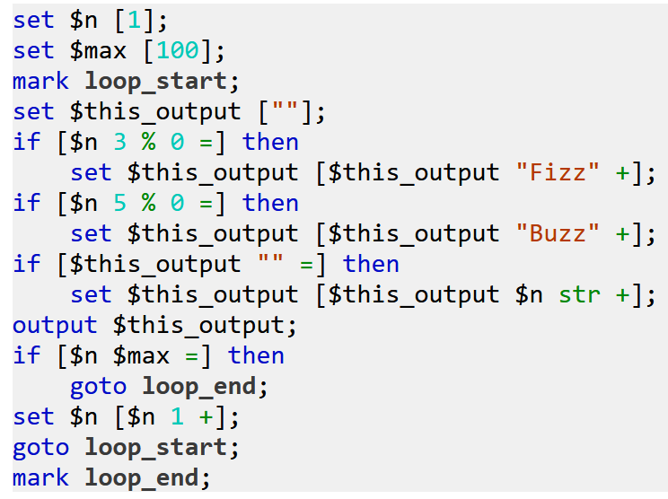
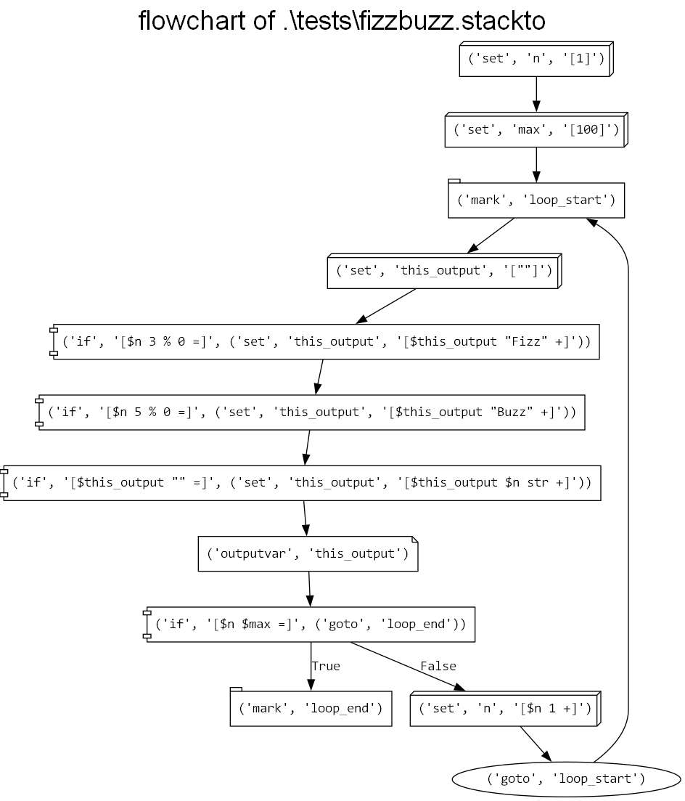

# StackTo

StackTo is a programming language that uses [GOTO](https://en.m.wikipedia.org/wiki/Goto) statements for control flow and [RPN](https://en.m.wikipedia.org/wiki/Reverse_Polish_notation) (with some additional QOL operators) for expression evaluation.

## Examples

### Hello world

```
output ['Hello, world!'];
```

### FizzBuzz

```
set $n [1];
set $max [100];
mark loop_start;
set $this_output [""];
if [$n 3 % 0 =] then
    set $this_output [$this_output "Fizz" +];
if [$n 5 % 0 =] then
    set $this_output [$this_output "Buzz" +];
if [$this_output "" =] then
    set $this_output [$this_output $n str +];
output $this_output;
if [$n $max =] then
    goto loop_end;
set $n [$n 1 +];
goto loop_start;
mark loop_end;
```

### Generate a list containing the first `n` primes

```
output ["Enter a number of primes to generate:"];
set $n input;
set $n [$n num];
output ["Generating a list of the first " $n str + " primes..." +];

set $i [2];
set $prime_list [0 \];

mark loop_start;

# determine whether $i is prime
set $j [2];
mark inner_loop_start;
set $is_prime [true];
if [$j $i 2 / >] then
    goto inner_loop_end;
set $rem_zero [$i $j % 0 = !];
if [$rem_zero] then
    set $j [$j 1 +];
if [$rem_zero !] then
    set $is_prime [false];
if [$rem_zero !] then
    goto inner_loop_end;
goto inner_loop_start;
mark inner_loop_end;

if [$is_prime] then
    output ["Found prime: " $i str +];

# $is_prime is true if $i is prime and false otherwise
if [$is_prime] then
    set $prime_list [$prime_list $i :];

if [$prime_list # $n =] then
    goto loop_end;

set $i [$i 1 +];

goto loop_start;
mark loop_end;

output ["First " $n str " primes: " $prime_list str + + +];
```


## Syntax highlighting

Syntax-highlighted HTML files of StackTo code can be generated by running [highlight.py](highlight.py):

```
usage: highlight.py [-h] [-o OUTFILE] [-s] infile

Generate a syntax-highlighted HTML file for a StackTo program.

positional arguments:
  infile                StackTo file to read from

optional arguments:
  -h, --help            show this help message and exit
  -o OUTFILE, --outfile OUTFILE
                        HTML file to write to
  -s, --standalone      Whether to generate a standalone HTML file as opposed to a fragment
```

Example output ([FizzBuzz](examples/tests/fizzbuzz.stackto)):



More examples of HTML files can be seen in [examples/highlighted](examples/highlighted).

## Flowcharts

Because of StackTo's simple control flow structure, it's easy to generate a flowchart of a given StackTo program.

Example:



You can check out more flowchart examples in [examples/flowcharts](examples/flowcharts).

Flowcharts can be generated by running [generate_flowchart.py](generate_flowchart.py), which uses the Graphviz Python library:

```
usage: generate_flowchart.py [-h] [-o OUTFILE] infile

Generate a flowchart PNG for a StackTo program using Graphviz.

positional arguments:
  infile                StackTo file to read from

optional arguments:
  -h, --help            show this help message and exit
  -o OUTFILE, --outfile OUTFILE
                        Graphviz/PNG filename to write to
```

Note that due to a [Graphviz limitation](https://github.com/xflr6/graphviz/issues/53), colon characters (`:`) are displayed as two periods (`..`) in the generated flowcharts.

## Usage

### Requirements

The StackTo interpreter is written in Python, so you will need Python installed to use it.

To generate flowcharts, you will need to install the Graphviz Python library if you don't have it already:

```bash
python -m pip install graphviz
```

### Interface

To run a StackTo program, put `interpreter.py` in your current directory and run the following command in the terminal:

```bash
python interpreter.py /path/to/file.stackto
```

```
usage: interpreter.py [-h] infile

Interpret a StackTo program.

positional arguments:
  infile      StackTo file to read from

optional arguments:
  -h, --help  show this help message and exit
```

## Grammar

StackTo's grammar is pretty simple. See [grammar.md](grammar.md).
 
## Evaluation pseudocode

Evaluating a StackTo program is also rather simple. See [evaluation_pseudocode.md](evaluation_pseudocode.md) for a general idea of how programs are evaluated, statement by statement.

## TODO list

The initial version of this language was put together in a weekend, so there are lots of things that remain to be done.

See [TODO.md](TODO.md) for a general idea of features and improvements that may eventually make their way into the language.